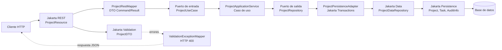

# Expo 01: El camino del dato

Esta carpeta contiene la versión de `ProjectTracker` usada para el primer acto de la charla: **cómo modelo, valido, expongo y persisto información con Jakarta EE 11**.

No está pensada como tutorial paso a paso. Es una foto funcional del proyecto para mostrar cómo varias especificaciones de Jakarta EE trabajan juntas en una aplicación empresarial pequeña, pero realista.

## Qué cubre

- **Jakarta REST** expone la API HTTP de proyectos.
- **JSON-B** serializa y deserializa los DTOs usados por la API.
- **Jakarta CDI** conecta recursos, servicios, mappers y repositorios.
- **Jakarta Persistence** modela entidades, relaciones y datos embebidos.
- **Jakarta Validation** expresa reglas del contrato de entrada.
- **Jakarta Data** reduce código de acceso a datos con repositorios declarativos.
- **Jakarta Transactions** delimita las operaciones de persistencia en el adaptador de salida.

La idea central de este acto es que el endpoint REST no sea el lugar donde vive toda la lógica. El recurso HTTP recibe la petición, valida el contrato, entra a la aplicación por un puerto de entrada y termina persistiendo mediante un puerto de salida implementado con Jakarta Data.

Después de la refactorización, el proyecto sigue siendo pequeño, pero la estructura ya conversa con una arquitectura hexagonal: la aplicación queda en el centro, REST es un adaptador de entrada y Jakarta Data/JPA quedan del lado de salida.

## Componentes principales

- `adapter.in.rest.ProjectResource`: adaptador HTTP para consultar y crear proyectos.
- `adapter.in.rest.dto.ProjectDTO`: contrato JSON validado con Jakarta Validation.
- `adapter.in.rest.mapper.ProjectRestMapper`: conversión entre el contrato REST y los modelos de aplicación.
- `application.port.in.ProjectUseCase`: puerto de entrada que expone los casos de uso.
- `application.service.ProjectApplicationService`: caso de uso de la aplicación.
- `application.port.out.ProjectRepository`: puerto de salida que la aplicación necesita para persistir proyectos.
- `adapter.out.persistence.ProjectPersistenceAdapter`: adaptador transaccional que implementa el puerto con Jakarta Data.
- `adapter.out.persistence.jakarta.ProjectDataRepository`: repositorio Jakarta Data con consultas derivadas.
- `domain.model.Project`, `Task`, `AuditInfo`: modelo persistente con Jakarta Persistence.
- `adapter.in.rest.mapper.ValidationExceptionMapper`: respuesta clara para errores de validación.
- `demo.cdi`: ejemplo pequeño de CDI con qualifiers.

## Diagrama

## Demo sugerida

1. Mostrar `GET /resources/projects`.
2. Crear un proyecto con `POST /resources/projects`.
3. Forzar un error de validación para mostrar el contrato.
4. Abrir `ProjectResource` y mostrar que el adaptador REST solo traduce HTTP hacia el puerto de entrada.
5. Abrir `ProjectUseCase` y `ProjectApplicationService` para mostrar el centro de la aplicación.
6. Abrir `ProjectRepository`, `ProjectPersistenceAdapter` y `ProjectDataRepository` para explicar el puerto de salida, la transacción y la consulta derivada `findByStatus`.
7. Abrir `demo.cdi` para mostrar qualifiers CDI sin mezclar esa demo con el flujo principal de proyectos.

## Mensaje para la charla

En este punto ya hay REST, JSON, validación, CDI, transacciones y persistencia trabajando bajo contratos estándar. La aplicación todavía no salió del ecosistema Jakarta EE, y aun así ya tiene una arquitectura separada por responsabilidades: los adaptadores cambian alrededor, pero los casos de uso quedan en el centro.
