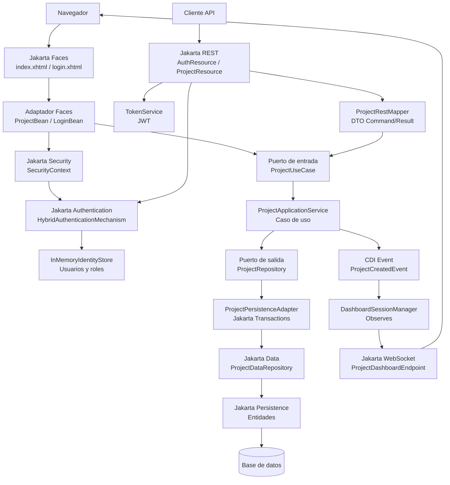

# Expo 02: El camino de la experiencia

Esta carpeta contiene la versión de `ProjectTracker` usada para el segundo acto de la charla: **cómo entregar una aplicación usable con Jakarta EE 11 sin asumir automáticamente una SPA**.

No reemplaza al tutorial por sesiones. Es una foto preparada para exposición, centrada en UI server-side, seguridad integrada y actualización en tiempo real.

## Qué cubre

- **Jakarta Faces** construye una interfaz server-side con XHTML y backing beans CDI.
- **Jakarta CDI** conecta la vista, los servicios y los eventos de dominio.
- **Jakarta Security** protege tanto la UI como la API.
- **Jakarta Authentication** implementa un mecanismo híbrido para sesión web y JWT.
- **Jakarta REST** conserva la API para clientes externos.
- **Jakarta WebSocket** permite notificaciones en tiempo real hacia el dashboard.
- **CDI Events** desacopla la creación de proyectos del broadcast WebSocket.
- **Jakarta Persistence, Validation y Data** siguen sosteniendo el camino del dato.

La idea central de este acto es mostrar que una aplicación empresarial interna puede tener UI, login, API protegida y actualizaciones en tiempo real sin añadir automáticamente un frontend separado.

Este proyecto continúa la organización de `expo-01` con una **arquitectura hexagonal pragmática**: los casos de uso viven en `application`, el modelo persistente queda en `domain.model`, y REST, Faces, Security, WebSocket y Jakarta Data se ubican como adaptadores alrededor.

## Componentes principales

- `adapter.in.web.ProjectBean`: backing bean para listar y crear proyectos desde Jakarta Faces.
- `adapter.in.web.LoginBean`: flujo de autenticación web.
- `adapter.in.security.SecurityConfig`: usuarios, roles y configuración Jakarta Security.
- `adapter.in.security.HybridAuthenticationMechanism`: seguridad híbrida para UI con sesión y API con JWT.
- `adapter.in.rest.AuthResource` y `adapter.in.security.TokenService`: login REST y emisión de tokens.
- `adapter.in.rest.ProjectResource`: API REST con `@PermitAll` y `@RolesAllowed`.
- `application.port.in.ProjectUseCase`: puerto de entrada compartido por REST y Faces.
- `application.service.ProjectApplicationService`: caso de uso de proyectos y publicación de evento CDI.
- `application.event.ProjectCreatedEvent`: evento de aplicación emitido al crear proyectos.
- `adapter.out.persistence.ProjectPersistenceAdapter`: adaptador transaccional de persistencia.
- `adapter.out.persistence.jakarta.ProjectDataRepository`: repositorio Jakarta Data con consultas derivadas.
- `adapter.in.websocket.ProjectDashboardEndpoint` y `DashboardSessionManager`: canal WebSocket para el dashboard.
- `demo.cdi`: ejemplo pequeño de CDI con qualifiers.

## Diagrama

## Demo sugerida

1. Entrar a `index.xhtml` y mostrar redirección a `login.xhtml`.
2. Iniciar sesión con un usuario del `InMemoryIdentityStore`.
3. Mostrar la pantalla de proyectos con Jakarta Faces.
4. Crear un proyecto desde la UI.
5. Abrir `ProjectUseCase` y mostrar que REST y Faces entran por el mismo puerto.
6. Mostrar un endpoint REST protegido con JWT y `@RolesAllowed`.
7. Abrir `ProjectApplicationService`, `ProjectCreatedEvent` y `DashboardSessionManager` para explicar el flujo CDI Event -> WebSocket.
8. Si el entorno está estable, mostrar la actualización por WebSocket al crear un proyecto.

## Resumen

Esto no significa que toda aplicación deba usar Jakarta Faces. Significa que no toda aplicación empresarial necesita pagar el costo de una SPA. Para sistemas internos, administrativos y transaccionales, Jakarta EE 11 permite construir una experiencia completa con menos piezas móviles, manteniendo los casos de uso al centro y agregando adaptadores según la experiencia que se quiere entregar.
