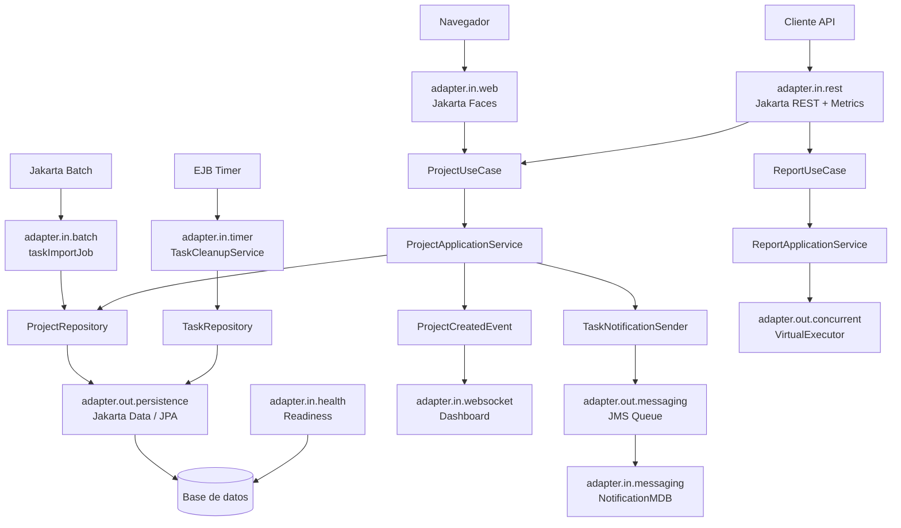

# Expo 03: El camino de producción

Esta carpeta contiene la versión final de `ProjectTracker` usada para el tercer acto de la charla: **cómo llevar una aplicación Jakarta EE 11 hacia una forma más moderna y operable**.

Es la continuación de `expo-01` y `expo-02`, manteniendo la misma **arquitectura hexagonal pragmática**: los casos de uso viven en `application`, el modelo persistente queda en `domain.model`, y las tecnologías de entrada/salida se organizan como adaptadores.

## Qué cubre

- **Jakarta Concurrency** ejecuta reportes en segundo plano con un `ManagedExecutorService` basado en virtual threads.
- **Jakarta Messaging** desacopla la creación de tareas de la notificación mediante JMS y un MDB.
- **Jakarta Batch** importa tareas por chunks desde un job declarado en XML.
- **EJB Timer** ejecuta limpieza programada de tareas antiguas.
- **MicroProfile Health** expone readiness para que la plataforma sepa si la app está lista.
- **Métricas Prometheus** exponen conteo y duración de requests para un visor local de O11Y.
- **GlassFish 8 + MySQL + Docker** cierran el camino con una imagen desplegable y configurable por variables de entorno.

## Componentes principales

- `application.port.in.ProjectUseCase`: puerto de entrada compartido por REST y Faces.
- `application.service.ProjectApplicationService`: casos de uso de proyectos/tareas y publicación de eventos CDI.
- `application.service.ReportApplicationService`: generación de reportes usando concurrencia administrada.
- `application.port.out.ProjectRepository`, `TaskRepository`, `TaskNotificationSender`: puertos de salida.
- `adapter.in.rest`: API REST, métricas, autenticación y disparo de jobs Batch.
- `adapter.in.web`: Jakarta Faces para la UI server-side.
- `adapter.in.websocket`: dashboard en tiempo real por WebSocket.
- `adapter.in.batch`: reader, processor y writer del job `taskImportJob`.
- `adapter.in.timer`: limpieza programada de tareas.
- `adapter.in.health`: readiness check de base de datos.
- `adapter.in.metrics`: métricas HTTP en formato Prometheus.
- `adapter.out.persistence`: implementación de persistencia con Jakarta Data/JPA.
- `adapter.out.messaging`: definición JMS y envío de notificaciones.
- `adapter.out.concurrent`: definición del executor con virtual threads.
- `demo.cdi`: ejemplo pequeño de CDI con qualifiers.

## Diagrama



## Demo sugerida

1. Mostrar que la UI y la API siguen entrando por los mismos casos de uso.
2. Crear un proyecto y ver la actualización por WebSocket.
3. Crear una tarea y explicar el desacoplamiento por JMS/MDB.
4. Solicitar un reporte y mostrar el log del virtual thread.
5. Ejecutar `POST /resources/projects/import` para iniciar el job Batch.
6. Mostrar readiness/metrics de MicroProfile.
7. Cerrar con Docker: la aplicación ya no solo funciona, también se puede operar.

## Mensaje para la charla

Producción no es solamente empaquetar un WAR. Producción es ejecutar trabajo largo sin bloquear, desacoplar procesos, observar estado y métricas, programar mantenimiento y desplegar de forma reproducible. La cereza es que todo esto sigue estando dentro del mismo modelo Jakarta EE, sin convertir la aplicación en una colección de piezas inconexas.

---

# Apéndice: Despliegue con Contenedores (Docker)

Hasta ahora, hemos ejecutado el servidor de aplicaciones de forma local. Eso está bien para desarrollo, pero en producción conviene empaquetar runtime, aplicación y configuración en una unidad reproducible.

Un contenedor empaqueta:

1.  El Sistema Operativo (mínimo).
2.  El Runtime de Java (JDK 21).
3.  El Servidor de Aplicaciones (GlassFish 8).
4.  Nuestra Aplicación (`.war`).
5.  Nuestra Configuración (pool JDBC, recurso JNDI, driver MySQL, colas, observabilidad, etc.).

**Objetivo:** Crear una imagen Docker de `ProjectTracker` sobre GlassFish 8, conectada a MySQL mediante variables de entorno y observable con Prometheus/Grafana.

-----

## 1\. Paso 1: Preparar la Configuración Automática

En desarrollo podemos ejecutar comandos `asadmin` manualmente para crear el pool de base de datos. En Docker, esa configuración debe viajar con la imagen.

El archivo [`post-boot-commands.asadmin`](post-boot-commands.asadmin) documenta los comandos `asadmin` que necesitamos para crear el pool y el recurso JNDI.
En la imagen oficial de GlassFish, esos comandos necesitan que el servidor ya esté escuchando en el puerto de administración, así que el Dockerfile usa un script [`docker-init.sh`](docker-init.sh) para preparar todo en orden:

1. Arranca el dominio temporalmente.
2. Crea el pool JDBC y el recurso `jdbc/projectTracker`.
3. Detiene el dominio.
4. Copia el WAR a `autodeploy` para que el arranque final ya encuentre el datasource.

```bash
# 1. Crear el Pool de Conexiones
# Fíjate en la magia: ${ENV=...}
# Esto le dice a GlassFish: "No uses un valor fijo, lee la Variable de Entorno del sistema".
create-jdbc-connection-pool \
    --datasourceclassname com.mysql.cj.jdbc.MysqlDataSource \
    --restype javax.sql.DataSource \
    --property "serverName=${ENV=DB_HOST}:portNumber=${ENV=DB_PORT}:databaseName=${ENV=DB_NAME}:user=${ENV=DB_USER}:password=${ENV=DB_PASSWORD}:useSSL=false:allowPublicKeyRetrieval=true" \
    ProjectTrackerPool

# 2. Crear el Recurso JNDI (El nombre que usa JPA en persistence.xml)
create-jdbc-resource \
    --connectionpoolid ProjectTrackerPool \
    jdbc/projectTracker

# 3. Configurar la Cola JMS
# (Si usaste @JMSDestinationDefinition en Java, esto es opcional, 
# pero hacerlo aquí es más "Infrastructure as Code")
```

**Nota:** GlassFish resuelve los valores `${ENV=...}` desde variables de entorno del contenedor. Si falta una, el arranque debe fallar rápido: mejor descubrir una configuración incompleta al desplegar, no en medio de una demo.

-----

## 2\. Paso 2: El [`Dockerfile`](Dockerfile)

Este archivo es la "receta" para construir nuestra imagen.

Crea un archivo llamado [`Dockerfile`](Dockerfile) (sin extensión) en la raíz del proyecto:

```dockerfile
FROM ghcr.io/eclipse-ee4j/glassfish:latest

ENV PATH_GF_HOME=/opt/gfinstall
ENV DEPLOY_DIR=${PATH_GF_HOME}/glassfish/domains/domain1/autodeploy
ENV CUSTOM_DIR=${PATH_GF_HOME}/custom
ENV APP_WAR=${CUSTOM_DIR}/project-tracker.war
ENV INIT_SH=${CUSTOM_DIR}/init.sh

USER root

# 1. Preparar la carpeta que ejecuta el entrypoint oficial de GlassFish
RUN mkdir -p ${CUSTOM_DIR}

# 2. Copiar la aplicación fuera de autodeploy hasta que existan los recursos JDBC
COPY target/project-tracker.war ${APP_WAR}

# 3. Copiar el script de inicialización que prepara GlassFish antes del arranque final
COPY docker-init.sh ${INIT_SH}

ENV MYSQL_CONNECTOR_VERSION=9.7.0

# 4. Descargar el driver JDBC de MySQL y dejarlo disponible para GlassFish
ADD https://repo1.maven.org/maven2/com/mysql/mysql-connector-j/${MYSQL_CONNECTOR_VERSION}/mysql-connector-j-${MYSQL_CONNECTOR_VERSION}.jar \
    ${PATH_GF_HOME}/glassfish/domains/domain1/lib/mysql-connector-j.jar

RUN chown glassfish:glassfish \
    ${APP_WAR} \
    ${INIT_SH} \
    ${PATH_GF_HOME}/glassfish/domains/domain1/lib/mysql-connector-j.jar

USER glassfish

EXPOSE 8080 4848
```

Este archivo  `Dockerfile`, como es una receta, tiene los pasos que deben hacerse para ejecutar la aplicación. El paso 3
es interesante, ya que descarga desde Maven Central el driver JDBC de MySQL. Mientras que en desarrollo podríamos copiarlo manualmente al servidor,
aquí queda automatizado dentro de la imagen.

En Docker, existe la instrucción `ADD`, que es capaz de descargar archivos desde una URL y colocarlos directamente en la imagen.

Todo esto se le llama "Infrastructure as Code".

-----

## 2.1\. Esquema de Base de Datos en Producción

En `expo-01` y `expo-02` usamos `drop-and-create` porque ayuda durante la demo: cada despliegue deja la base en un estado conocido.
En esta etapa eso ya no representa un comportamiento de producción, porque redeplegar la aplicación no debe borrar los datos.

Por eso, en [`persistence.xml`](src/main/resources/META-INF/persistence.xml) la generación de esquema queda desactivada:

```xml
<property name="jakarta.persistence.schema-generation.database.action" value="none"/>
```

El esquema inicial para el entorno Docker vive fuera del WAR, en [`expo-00-setup/database/initdb/01-project-tracker.sql`](../../expo-00-setup/database/initdb/01-project-tracker.sql).
MySQL ejecuta ese script solamente cuando el volumen `mysql_data` nace vacío. Si quieres reiniciar la demo desde cero:

```powershell
cd ../../expo-00-setup/database
docker compose down -v
docker compose up -d
```

En un entorno real, este mismo rol lo tomaría una herramienta de migraciones como Flyway, Liquibase o el pipeline de base de datos de la organización.

-----

## 3\. Paso 3: Construir la Imagen

Maven construye el `.war` y la imagen Docker en un solo paso usando perfiles:

```sh
mvn -Pdist-glassfish package
```

Esto usa [`Dockerfile`](Dockerfile) y crea la imagen:

```sh
project-tracker-prod-path:glassfish
```

El perfil compila `target/project-tracker.war`, descarga la imagen base de GlassFish desde GHCR y copia tu aplicación dentro.

-----

## 4\. Paso 4: Ejecutar el Contenedor (Conectando las piezas)

Ahora vamos a ejecutar nuestra aplicación. Aquí es donde cumplimos el punto 4: **Conectar mediante variables de entorno.**

Pero antes, debemos recordar que vamos a conectarnos con la base datos.

Recordemos que la base de datos MySQL está ejecutándose en Docker usando [`compose.yaml`](../../expo-00-setup/database/compose.yaml).
Así que debemos **acceder a la red de ese contenedor**, y debemos **acceder al host** donde está base de datos.

Para conocer la red de ese contenedor, podemos listar los contenedores activos y ver la columna `NETWORKS`:

```sh
docker ps --format "table {{.Names}}\t{{.Image}}\t{{.Networks}}\t{{.Ports}}"
```

En este ejemplo, tanto GlassFish como MySQL deben estar en la red `database_default`.

También puedes revisar el nombre de la carpeta donde se encuentra el archivo `docker-compose.yaml`.
Si el compose está dentro de la carpeta `database`, Docker Compose suele crear una red llamada `database_default`:


Luego, desde una ventana de comandos, ejecutamos lo siguiente:

```shell
docker network ls
```

Y busca el que mismo nombre de la carpeta que tenga sufijo `_default`, en esta caso sería:


Por tanto, la red se llama: `database_default`.

Ahora, para obtener el host de la base de datos, usa el nombre del contenedor MySQL que aparece en `docker ps`.
En este ejemplo es:

```text
project_tracker_mysql_db
```

Ese nombre es el que Docker puede resolver como DNS interno cuando ambos contenedores están en la misma red.

Con esos valores, ejecuta en tu terminal:

```sh
docker run -d \
  -p 8080:8080 \
  -p 4848:4848 \
  --name project-tracker-container \
  --net database_default \
  -e DB_HOST="project_tracker_mysql_db" \
  -e DB_PORT="3306" \
  -e DB_NAME="PROJECT_TRACKER" \
  -e DB_USER="PROJECT_TRACKER" \
  -e DB_PASSWORD="PROJECT_TRACKER" \
  project-tracker-prod-path:glassfish
```
\
**Powershell:**
```powershell
docker run -d `
  -p "8080:8080" `
  -p "4848:4848" `
  --name project-tracker-container `
  --net database_default `
  -e DB_HOST="project_tracker_mysql_db" `
  -e DB_PORT="3306" `
  -e DB_NAME="PROJECT_TRACKER" `
  -e DB_USER="PROJECT_TRACKER" `
  -e DB_PASSWORD="PROJECT_TRACKER" `
  "project-tracker-prod-path:glassfish"
```

**Desglose del comando:**

* `-d`: Detached (corre en segundo plano).
* `-p 8080:8080`: Conecta el puerto 8080 de tu máquina al 8080 del contenedor.
* `--name`: Le da un nombre fácil para administrarlo.
* `-e VAR=VAL`: **Aquí está la clave.** Pasamos las variables de entorno que el script de inicialización `docker-init.sh` está esperando.

-----

## 5\. Verificar el Despliegue

1.  **Ver logs:**
    Mira cómo arranca GlassFish y ejecuta tus scripts.

    ```sh
    docker logs -f project-tracker-container
    ```

    *Busca líneas de `start-domain`, `create-jdbc-connection-pool`, `create-jdbc-resource` y luego el despliegue de `project-tracker.war`.*
    

2.  **Probar la App:**
    Abre tu navegador en `http://localhost:8080/project-tracker/`.
    ¡Deberías ver tu aplicación funcionando\!
    

3.  **Probar la Consola de Administración (Opcional):**
    Abre `https://localhost:4848` (acepta la advertencia de seguridad SSL).
    El usuario por defecto suele ser `admin` (contraseña `admin`). Aquí podrás ver que tu Pool de conexiones `ProjectTrackerPool` fue creado exitosamente.
    

-----

## 5.1\. Variante: El mismo WAR en Payara 7

Para demostrar portabilidad Jakarta EE, este proyecto también incluye [`Dockerfile-payara`](Dockerfile-payara).
La aplicación no cambia: se usa el mismo `target/project-tracker.war`, el mismo `persistence.xml` y el mismo recurso JNDI `jdbc/projectTracker`.

La diferencia está en el runtime:

- `Dockerfile` usa **Eclipse GlassFish 8**.
- `Dockerfile-payara` usa **Payara Server 7**.
- [`payara-init.sh`](payara-init.sh) prepara el pool JDBC de forma idempotente antes del despliegue final.

Construye la imagen Payara con Maven:

```powershell
mvn -Pdist-payara package
```

Esto usa [`Dockerfile-payara`](Dockerfile-payara) y crea la imagen `project-tracker-prod-path:payara`.

Ejecuta Payara en la misma red de MySQL. En este ejemplo uso puertos alternos para poder comparar con GlassFish sin apagarlo:

```powershell
docker rm -f project-tracker-payara-container

docker run -d `
  -p "9080:8080" `
  -p "9484:4848" `
  --name project-tracker-payara-container `
  --net database_default `
  -e DB_HOST="project_tracker_mysql_db" `
  -e DB_PORT="3306" `
  -e DB_NAME="PROJECT_TRACKER" `
  -e DB_USER="PROJECT_TRACKER" `
  -e DB_PASSWORD="PROJECT_TRACKER" `
  "project-tracker-prod-path:payara"
```

Verifica:

- Aplicación: `http://localhost:9080/project-tracker/`
- Health: `http://localhost:9080/health/ready`
- API: `http://localhost:9080/project-tracker/resources/projects`
- Metrics: `http://localhost:9080/project-tracker/resources/observability/metrics`

Busca en logs:

```powershell
docker logs -f project-tracker-payara-container
```

Deberías ver que Payara ejecuta `init_0_project_tracker_jdbc.sh`, crea `ProjectTrackerPool`, registra `jdbc/projectTracker` y despliega `project-tracker.war`.

-----

## 6\. La Cereza: Observabilidad Local

El compose de [`expo-00-setup/database`](../../expo-00-setup/database/compose.yaml) también puede levantar un pequeño stack O11Y:

- **Prometheus** recolecta `/project-tracker/resources/observability/metrics` desde la aplicación.
- **Blackbox Exporter** prueba `/health/ready`.
- **Loki + Promtail** recolectan logs de los contenedores.
- **Grafana** muestra un tablero local de salud, métricas y logs.

Levanta MySQL y las herramientas de observabilidad:

```sh
cd ../../expo-00-setup/database
docker compose up -d
```

Luego levanta la app en la misma red `database_default`:

```powershell
docker rm -f project-tracker-container

docker run -d `
  -p "8080:8080" `
  -p "4848:4848" `
  --name project-tracker-container `
  --net database_default `
  -e DB_HOST="project_tracker_mysql_db" `
  -e DB_PORT="3306" `
  -e DB_NAME="PROJECT_TRACKER" `
  -e DB_USER="PROJECT_TRACKER" `
  -e DB_PASSWORD="PROJECT_TRACKER" `
  "project-tracker-prod-path:glassfish"
```

Abre:

- Aplicación: `http://localhost:8080/project-tracker/`
- Health: `http://localhost:8080/health/ready`
- Metrics: `http://localhost:8080/project-tracker/resources/observability/metrics`
- Prometheus: `http://localhost:9090`
- Loki: `http://localhost:3100/ready`
- Grafana: `http://localhost:3000` (`admin` / `admin`)

En Grafana encontrarás el dashboard **ProjectTracker O11Y**. Para generar señales, consume la API o navega la UI varias veces; el adaptador `adapter.in.metrics` expondrá contadores y duración de requests en formato Prometheus, y Loki mostrará los logs del contenedor `project-tracker-container`.

-----
 
¡Listo\! Has empaquetado tu aplicación Jakarta EE en una unidad inmutable. Ahora puedes construir `project-tracker-prod-path:glassfish` o `project-tracker-prod-path:payara` desde Maven y demostrar la portabilidad del mismo WAR en dos runtimes Jakarta EE.
 
